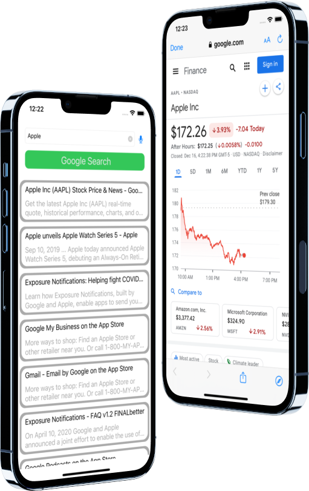
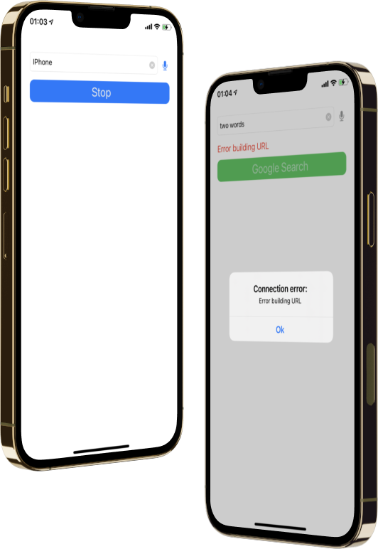

# GoogleSearch

## Introduction

Hi, my name is Aleksandr. I'm glad to see you on my [GitHub](https://github.com/AleksandrBasov?tab=repositories).

## Features

The application is developed in Swift language. I used MVVM architecture in my project.

<h1 align="center">

</h1>

The app sends a search query to google.com and also displays a progress bar on the ProgressView. if an error occurs, an Alert will show you.

<h1 align="center">

